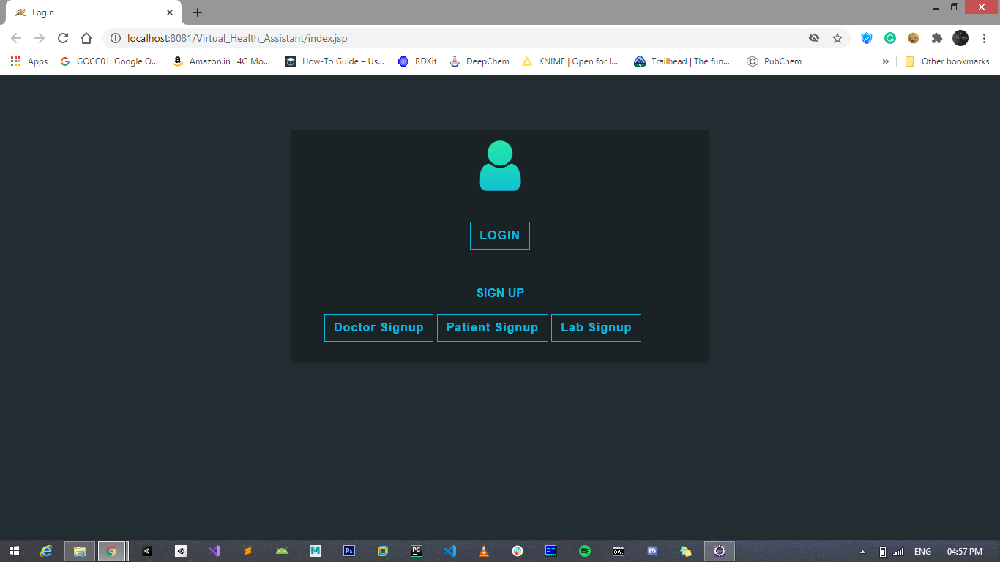
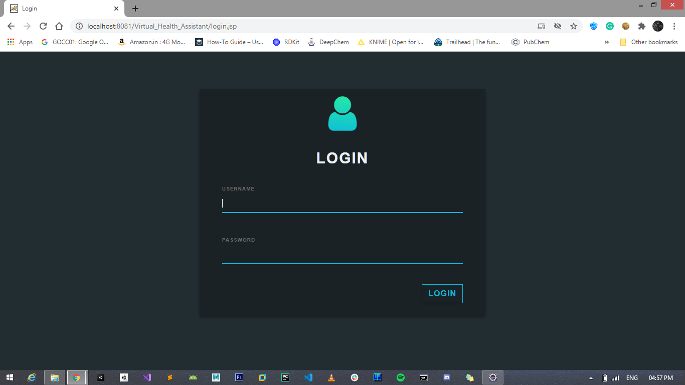
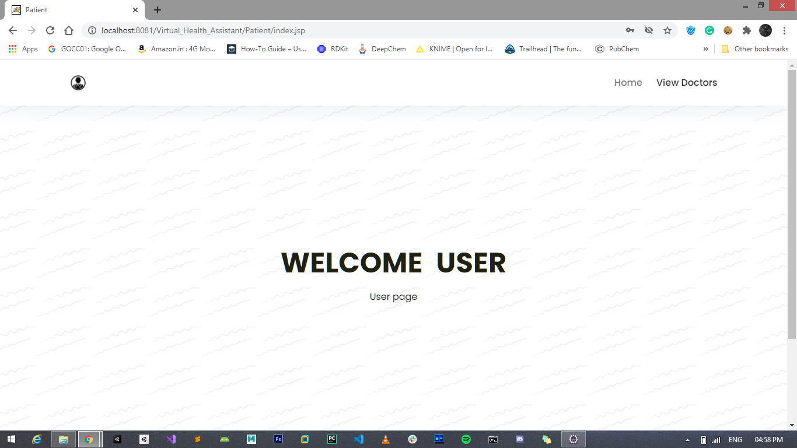
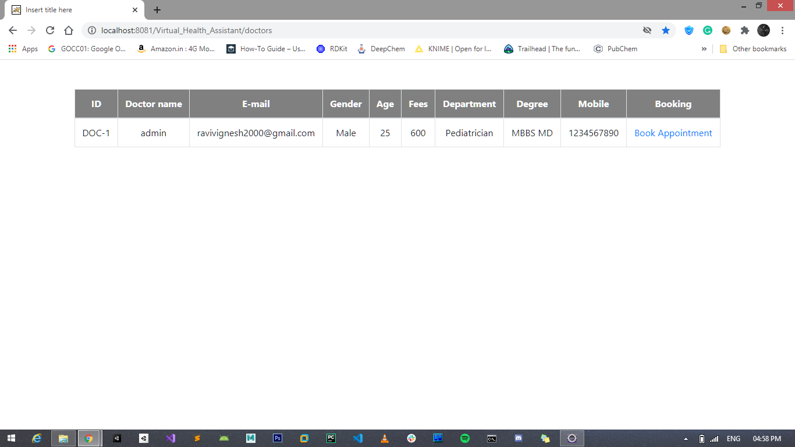
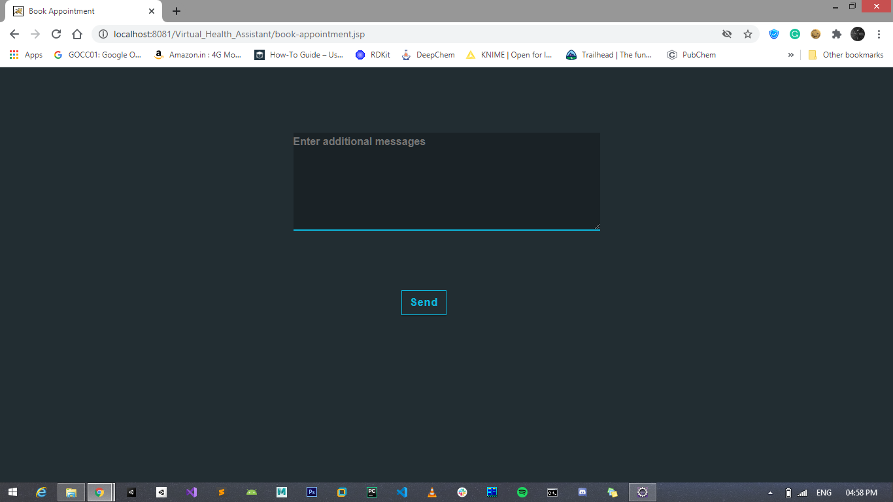
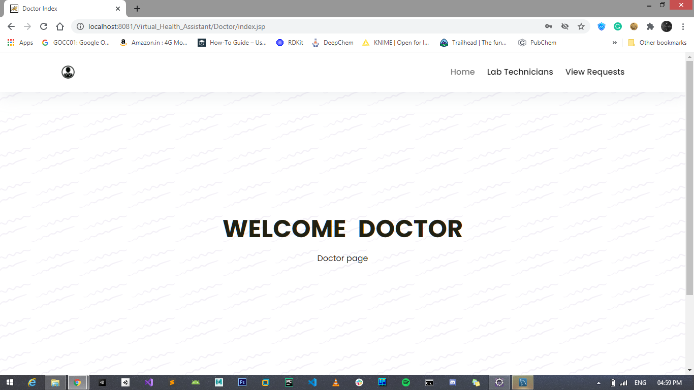
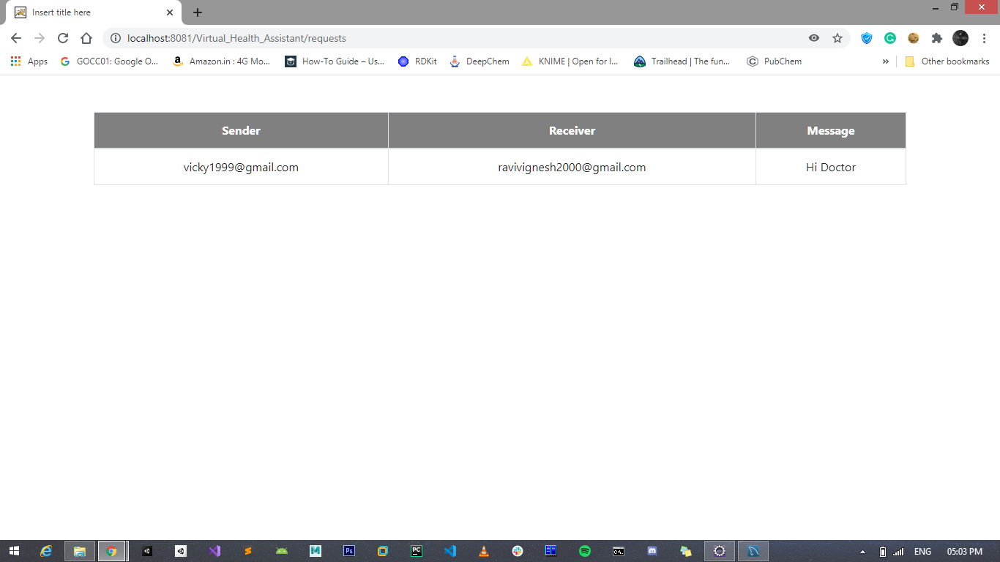
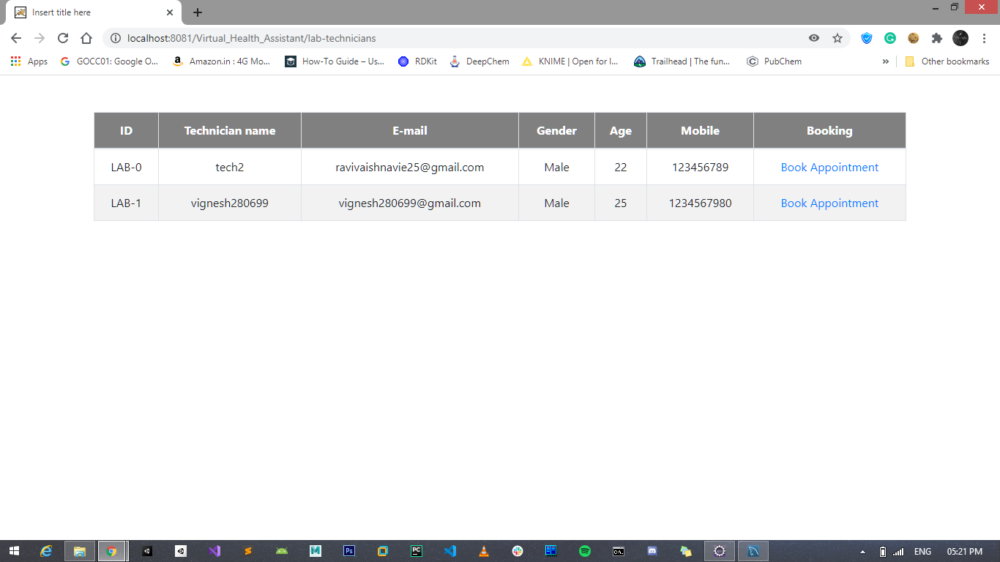
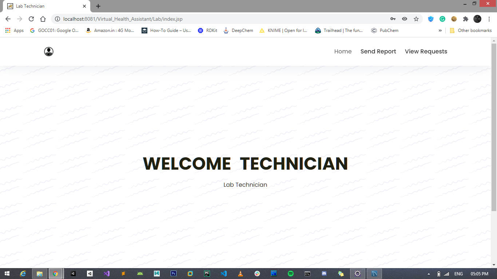
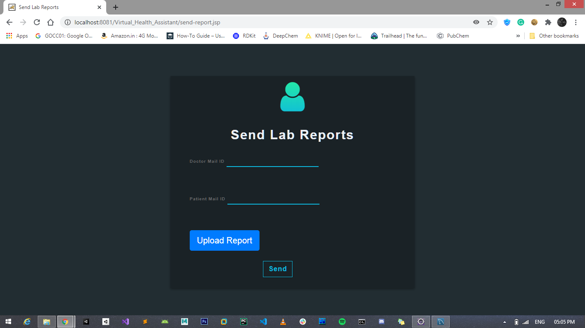

# virtual-health-assistant

<b><u> Objective:</u></b> 
VMedico is an online medical services company recently established by a pharmaceutical company to
enable not only tele-consulting services integrating doctor and patients but also to integrate laboratory
reports and to monitor the health of patients. 

# OUTPUTS:
<b><u>Index Page</u></b>
 

<b><u>Login Page</u></b>
 

<b><u>User(Patient) Index Page</u></b>
 

<b><u>View Doctors Page</u></b>
 

<b><u>Send Appointment Request via mail</u></b>
 

<b><u>Doctor Index Page</u></b>
 

<b><u>View Appointment Requests sent by Patients</u></b>
 

<b><u>View Lab Technicians Page</u></b>
 

<b><u>Lab Technician Index Page</u></b>
 

<b><u>View Lab Test Requests Sent by doctors</u></b>
 

<b><u>Send Lab Reports via mail to Patient and the Doctor</u></b>
 

